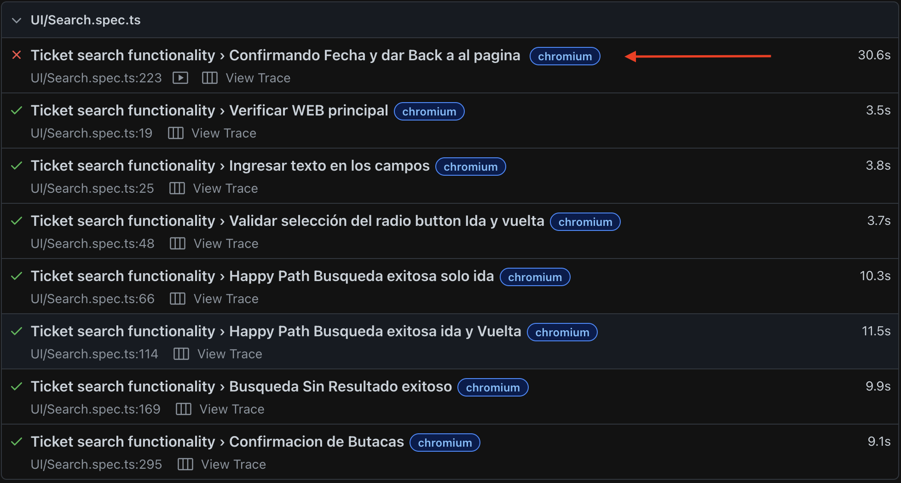
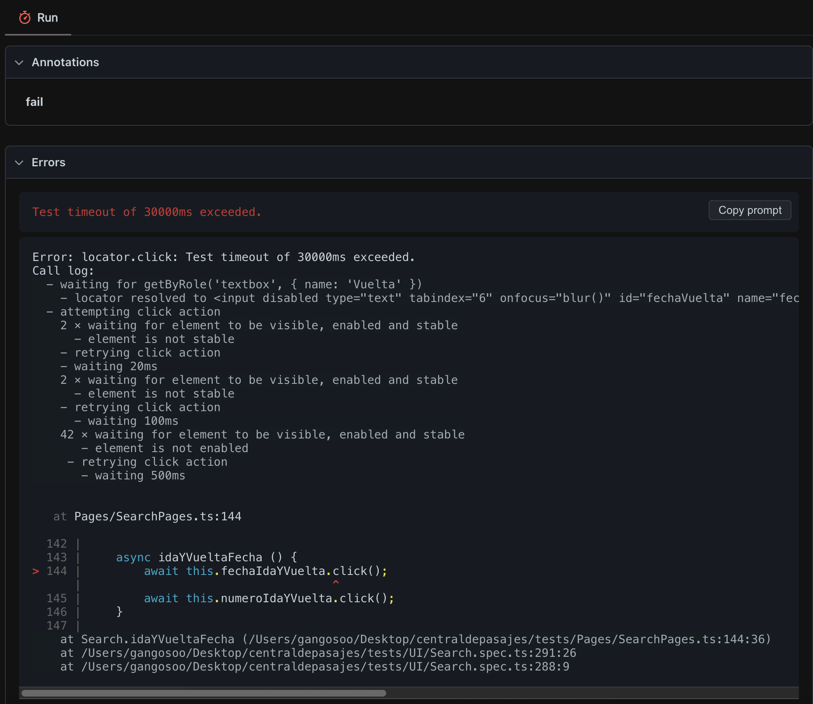
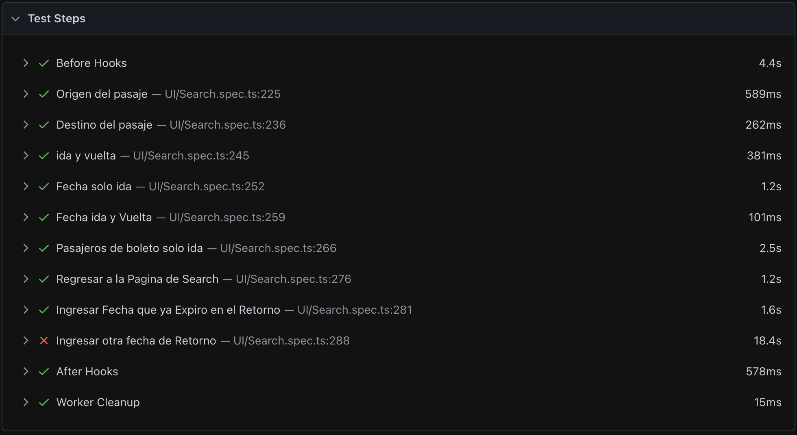
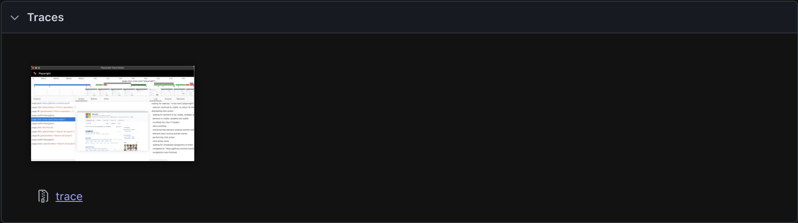
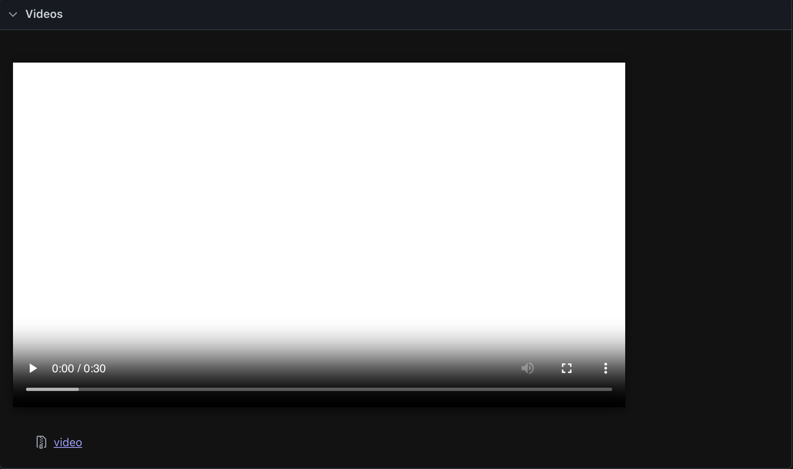

# central de pasajes - 🚌

# 1.- Pruebas Automatizadas central de pasajes 

Bienvenidos al script desarrollado para el sitio de Central de Pasajes.

El presente documento tiene como objetivo proporcionar una guía técnica y estructurada para abordar las tareas y desafíos planteados en la prueba técnica. Para esta implementación se realizarán pruebas manuales y automatizadas, enfocadas en la validación funcional de los flujos principales de la plataforma, la detección temprana de defectos y la correcta verificación del comportamiento del sistema durante el proceso de búsqueda y compra de pasajes.

El script ha sido diseñado siguiendo buenas prácticas de automatización, priorizando la eficiencia, la mantenibilidad y la escalabilidad del código, con el fin de facilitar su comprensión, integración y reutilización en futuros procesos de pruebas. Asimismo, busca contribuir a la mejora continua de la calidad del producto y fortalecer la colaboración entre los equipos involucrados en el desarrollo y aseguramiento de la calidad del software.

Avancemos con un enfoque técnico sólido para garantizar la correcta ejecución de cada escenario de prueba y el cumplimiento de los objetivos planteados. Bienvenidos al script diseñado para validar el correcto funcionamiento de la plataforma de Central de Pasajes.

# 2.- Como Clonar Repositorio 🔧

Abrimos Consola y Colocamos

git init

git clone https://github.com/GangosoO/Central-de-Pasajes-POM-AAA.git

# 3.- Instalar dependencias del Script 📝

1 - Arrastramos carpeta centraldepasajes al gestor de Codigo

2 - Reinstalamos playwright en la consola del gestor de Codigo

`npm install`

## 📝 Scripts Disponibles

- `npx playwright test --ui` - Ejecuta las pruebas habriendo el Test Runner
- `npx playwright test --project=chromium` - Ejecuta las pruebas en modo headless
- `npx playwright test` - Ejecuta todas las pruebas

## 📁 Estructura del Proyecto

```
CENTRALDEPASAJES
│
├── .github/
│   └── workflows/
│       └── playwright.yml              # Pipeline de CI/CD
│
├── Imagenes/                           # Evidencias de bugs encontrados
│   ├── Bug.png
│   ├── Bug1.png
│   ├── Bug2.png
│   ├── Bug3.png
│   └── Bug4.png
│
├── node_modules/                       # Dependencias del proyecto
│
├── playwright-report/                  # Reporte HTML generado por Playwright
│
├── test-results/                       # Resultados de ejecución de tests
│
├── tests/                              # Carpeta principal de pruebas
│   │
│   ├── Pages/                          # Implementación del Page Object Model
│   │   └── SearchPages.ts
│   │
│   └── UI/                             # Pruebas de interfaz de usuario
│       └── Search.spec.ts
│
├── .gitignore                          # Archivos ignorados por Git
│
├── package-lock.json                   # Control de versiones de dependencias
│
├── package.json                        # Configuración del proyecto Node.js
│
├── playwright.config.ts                # Configuración global de Playwright
│
└── PREGUNTAS.md                        # Preguntas sobre el challenge
│                          
└── README.md                           # Documentación del proyecto
```

## 🧪 Comando pare ejecutar correctamente el Show Report

1. Ingresar antes de cada Prueba completa

- `npx playwright show-report` 












## ⚙️ Configuración

La configuración de playwright se encuentra en `playwright.config.ts`. Puedes modificar:
- `baseUrl`: URL base de tu aplicación
- `projects`: Para diferentes tipos de pruebas
- `defaultCommandTimeout`: Tiempo de espera por defecto

## 🎯 Próximos Pasos

1. Crear nuevos Page Objects dentro de tests/Pages/ siguiendo el patrón Page Object Model (POM) utilizado en el proyecto.

2. Agregar nuevos escenarios de prueba dentro de tests/UI/ para ampliar la cobertura de pruebas funcionales de la aplicación.

3. Ajustar o personalizar la configuración global del framework en playwright.config.ts según las necesidades del proyecto (timeouts, navegadores, reportes, etc.).

4. Integrar y validar la ejecución automática de las pruebas mediante el pipeline configurado en GitHub Actions.

## 📚 Recursos

- [Guía de Playwright Test](https://playwright.dev/docs/test-intro)
- [Configuración de Playwright](https://playwright.dev/docs/test-configuration)

## ⌨️ Objetivo

- El propósito de este proyecto es implementar una solución de automatización de pruebas que permita:

- Validar los flujos principales de la plataforma.

- Detectar defectos de manera temprana.

- Garantizar la estabilidad del sistema.

- Facilitar la ejecución de pruebas repetibles dentro de procesos de integración continua.

## 💻 Tecnologías utilizadas

Para el desarrollo de esta solución se utilizaron las siguientes herramientas:

Playwright – Automatización de pruebas End-to-End.

Node.js – Entorno de ejecución.

TypeScript – Tipado estático para mayor robustez del código.

GitHub – Control de versiones y gestión del repositorio.

GitHub Actions – Ejecución automática de pruebas mediante pipelines.

## 📋 Escenarios de prueba automatizados

- Dentro del proyecto se automatizan diferentes flujos funcionales del sistema, tales como:

- Búsqueda de viajes entre origen y destino.

- Selección de fechas de viaje.

- Validación de disponibilidad de asientos.

- Selección de butacas disponibles.

- Verificación de información mostrada al usuario.

- Estos escenarios permiten validar los comportamientos principales del sitio y asegurar su correcto funcionamiento.